# Micro­Trak RTG -FA
Micro­Trak RTG APRS tracker/Beacon hardware. The MicroTrak tracker line combines the TinyTrak controller with a supplied GPS and built in 10-watt frequency agile VFO / 2-meter (144 MHz - 148 MHz)transmitter. built in telemetry support to transmit supply voltage and temperature more details [here](http://www.byonics.com)..

Also See Building a weather tight housing for the device [here](housing/README.md)

# Getting Started
Community [Support](https://groups.io/g/TinyTrak)

## GPS
Likely best to buy the one they sell (of which there are two, mentions one has better altimeter screen printed on top visually) its a very nice [chip](https://www.mouser.com/new/lantronix/lantronix-sirfstar-iv-modules/). The MicroTrak's requires 'serial standard NEMA', not newer chip/sentences, they have a GUA cable or a USB to GPS cable to power the  factory GPS directly to PC which is recommended for using a pi to fiddle with the data, watch your port current a hub is recommended. The factory chip is fast and has nice boot-up includes some fancy technology.

## Connections power and serial
The other item to be sure to have is [cables](http://www.byonics.com/cables) TT-USB and a PP-RTG(included)/w null-modem(3rd party supply)
 - one or all three (usb/PP-RTG+null) are needed.
 - Byonics' adds 5v to the DB9 ports for the GPS and this is used by the TT-USB as well to power the device while programming. To keep this isolated recommend using the manufacture cables which are all labeled.
 - You can use the PP-RTG with your own injected ~8v/12v and a null modem cable or adapter to your computer serial. If you power it to 12v ***have a RF load connected.***
 - You can use the TT-USB to the device directly nothing else needed, watch your port current, suggest a hub.

## Connection antenna
The full ready to go kit, includes a mag-mount, SMA-M 2m antenna with about 6 foot of coax. The antenna will likely be damaged in shipping and its base can use a spot of gorilla glue, as it will break. It works, its retail-shipped price is around $30 in 2022-USD, to be clear..  its a $5 antenna you will use for too long, or never. They also sell a v6 dipole that is about the size of your hand. I wouldn't recommend, use your own mag-mount or ladder J-pole for terrestrial work. the stuff they up-sell works but its not worth the value long term. Antenna is not Wx rated at all, don't leave in rain, at minimal crack open the base, and fill it with glue to waterproof this cavity and keep magnet inside.

Recommended upgrade [MR77SMA](https://www.diamondantenna.net/mr77sma.html)

# Documentation

The [Manual](doc/MicroTrak_RTG_FA_Manual_v1.8-2.pdf) describes the hardware and firmware functions.

The [Config Manual](doc/TinyTrak3_Config_Manual_v1.4.pdf) is also mandatory to review as it has lots of nerdy bits 'the advanced manual.'
- A difference shipped device has the following autoTXD changes as defaults
- 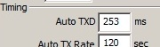

NOTE the TinyTrak3Config v1.4.6.exe tool works under wine, additionally with box86 it works on raspberry-pi4 wine. It appears COM port mapping might need work as no ports are found however.. need to test more.

## QuickSetup

Following is for temp return in F
```
PARM.Battery,Temp
UNIT.Volts,Deg.F
EQNS.0,0.0293,0,0,0.879,-­459.67
```
Following for temp return in C
```
PARM.Battery,Temp
UNIT.Volts,Deg.C
EQNS.0,0.0293,0,0,0.489,-­273.15
```

enter the data into [findu entermsg tool](http://www.findu.com/cgi-bin/entermsg.cgi)
- I have found issues with the EQNS, I cant send it to myself like the manual shows.
  - If using a SSID it works FROM TO cant be the same call possibly?
    - so if your device is programed for N0CALL-4 you want to send from NOCALL
  - if you mess up send the same VAR into the message tool (PARM,UNIT,EQNS)
  - if you continually have issues try using a friends call-ID as the FROM call.
  
## Backup default device
 - Recommend a read config, a save config and set that .tt3 file to readonly status. This way you have a safe default copy. 
 - now when changes are made pressing save will ask what to save new file and not your default!

## Software

These are recommended changes to make to the default config as shipped. 

NOTE the TinyTrak3Config v1.4.6.exe tool works under wine, additionally with box86 it works on raspberry-pi4 wine. It appears COM port mapping might need work as no ports are found however.. need to test more.

 - UART enable
   - Allow TTL Serial, enable to have easy interface with raspberry pi GPIO or similar.
 - Switch for profiles, make a 2nd one..
   - see photo for switch mounting idea
 - 3rd Telemetry input
    - make sure to click edit telemetry and you can
    - Set up auto telemetry reporting (aka not use the findu.cgi over the air) by clicking the edit telemetry button
    - Change channels to three
      - 1 supply voltage, sampled from PIC RB4/11 "pin7"
      - 2 LM-335 temp sampled from PIC RB2/9 "pin8"
      - 3 "T" PCB pin-header (2mm pitch), sampled from PIC ~~RB5/12~~ RB6/13 "pin11"
    - Definition Rate 0 assume is off??

### Firmware Notes
 - TinyTrak firmware takes in NMEA serial GPS data, and sends out APRS formatted position packets
 - WXTrak firmware takes in serial data from a weather station and sends out APRS weather packets
 - TinyPack firmware takes in any serial text terminated with carriage return, and sends that as a UI packet. It is used to do custom transmissions, plus works with the Davis weather stations that send out APRS strings natively.


# Advanced modding
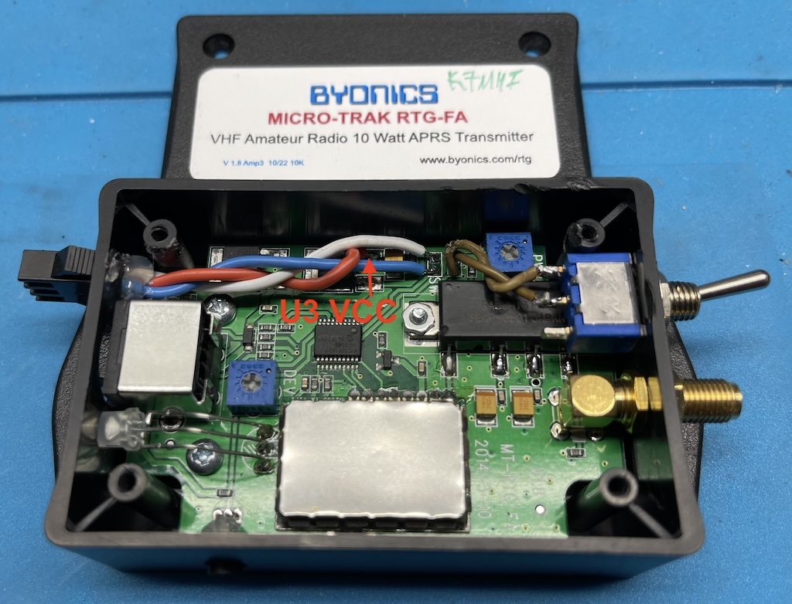

Shown with 3-pin JST-SM connector for sensor attachment. photo here shows functioning connections to the hardware received nov-2022. jumpers used to extend the telemetry port externally when used.

The newest RTG's ( made in the last few years and having an SMD PIC, have 20 pin devices. The older units use an 18 pin DIP PIC, so you need to make sure you are looking at schematics for the current version, V1.8. On this board, the PCB silkscreen "T" and the SW" are backwards..that is to say, next to the wrong inputs. "SW" is actually the 0-5 Volt analog input, and "T" is for an external profile switch to select one of two configurations. 

# Adding sensors

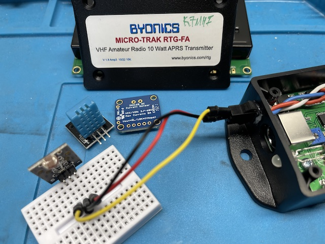

I found a good way to get connectivity in the small package is with `3-pin JST-SM connector` commonly used in LED lighting.

Byonics uses a 2.2k protection limiting resistor on both FA devices so that is a good place to start. 
- Pull-up or Pull-down depending on your needs and sensor.

Sensors are limitless, thermal resistors for freeze alarms, wind speed, light sensors [adafruit](https://www.adafruit.com/category/35) has good ideas and documentation to get sensors functioning.

## VCC
See image [above](#advanced-modding) Tap +5vcc directly off the 5 Volt regulator's U3 output pin PIN3. (***Note*** that there is a 12 Volt regulator too...don't tap that one!!) it is not recommended to use the DB9 GPS power.

## SIGnal
Again note, the T and S markings are reversed, so "S screen-print" is for the telemetry input. S is for switch see photo above and notice where the wires travel to make this clear. 
- There is a ground connection at 2mm spacing. 
- We will call it the T/telemetry line and not reference the screen-prints.

This telemetry line feeds the device (PIC/RB6/13 "pin11") analog 5vREF

**before you do any of this, remember that the PIC is 5v and this is a unprotected line**
Protection limiting is recommended a 2.2k resistor before signal injected into PIC

## GND
There is a ground connection at 2mm spacing headers, this is uncommon spacing.

# EQNS
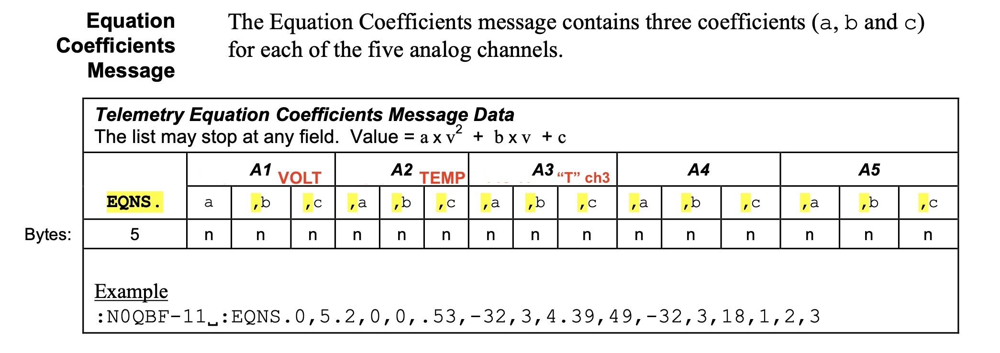
[EQNS](https://en.wikipedia.org/wiki/Equation) explained in APRS.org document snip with red text overlay showing this device values.

Following is for temp return in F
```
PARM.Battery,Temp
UNIT.Volts,Deg.F
EQNS.0,0.0293,0,0,0.879,-­459.67
```
 - PARM line give a description of each telemetry channel
 - UNIT line gives a textual unit to describe each channel
 - EQNS line gives a A B, and C for each Analog channel (we have 3)
   - Ax^2 + Bx + C where x is the 3 byte decimal telemetry (analog value reading)
   - EQNS. `Ax^2,Bx,C`  **,**  `Ax^2,Bx,C`   **,**  `Ax^2,Bx,C`
   - EQNS. `Volts`  **,**  `Deg`   **,**  `Chan3-AUX`
   - EQNS. (`0,0.0293,0`),(`0,0.879,-­459.67`),(`0,0,0`)

## Voltage
The volts `0,0.0293,0` is calculated in the following way. 

Input supply voltage (commonly 12v battery) passes a voltage divider (10k resistor on its way to the PIC with a PULL-DOWN of 2k to ground) these resistor values leave us with 1/6 Supply, giving linear analog voltage we need voltage is now on vcc reference scale. for the the 3 byte decimal telemetry. 

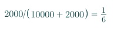

Voltage [divider](https://ohmslawcalculator.com/voltage-divider-calculator) resistor values leave us with 1/6 Supply now voltage is on vcc reference scale. so we need to get the last math out of the way.

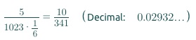

5vcc reference, divided by our PIC analog resolution/digital conversion of 1023. multiplied by the 1/6th output. leaves us with `0.0293` the supply voltage for display reading on the aprs.fi web-page.
  - The PIC analog read value is a number between 0 (for 0 volts) and 1023 resolution (for 5 volts PIC reference).
  - Reverse: look at live telemetry data, volt packet might be `442` which 445*0.0293 displays Battery: 13.038v on aprs.fi
  - back to EQNS (Ax^2 + Bx + C). The first 3 numbers in the EQNS:
    - A = 0, B = 0.0293, and C = 0

so volts `0,0.0293,0` or `EQNS.0,0.0293,0` and we just keep stacking ...

## Temp
The EQNS Temp `0,0.879,-­459.67`°F is calculated in the following way.

The [LM-355](https://www.ti.com/product/LM335) temperature sensor value is 10 mV/°K, analog linear output resolution is 5v/1023 for the 3 byte decimal telemetry. and the polynomial equation or algebraic equation or imperial EQNS to get Fahrenheit out of zero Kelvin is (0K − 273.15) we now have Celsius, multiplied by 9/5 + 32 = `-459.67`°F. 
- so the following 0K temperature sensor value conversion to °F, 10 mV/°K
- C= 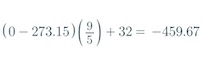

Meanwhile back @ EQNS for °F
- (Ax^2 + Bx + C) would be `A = 0, B = 0.879, and C = -459.67`
- B= 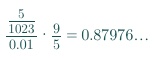
- LM-355 voltage(5V/1023) / 0.01V = 0.489 and then multiplied by 9/5) = `0.879` the value of B
- Then 459.67 is subtracted for final display

The reverse value lets say decimal telemetry value 604 is the value for the LM-355 sensor sent out the radio
  - radio TX a value of `604` for temp telemetry ...brrraaappp
  - aprs fi EQNS was prepared for displaying 604 with A=0,B=(0.879),C=(minus 459.67)
    - A=(0(604)^2) = 0
    - B=(604*0.879)
    - C=(604-459.67)
    - 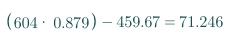
    - A+B+C = 71°F

The EQNS Temp `0,0.489,-­273.15`C, is calculated in the following way
- For Celsius, Kelvin conversion is quick zero K to °C (0K − `273.15`) negative 273°C
- 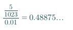
- B = `0.489` rounded
- LM-355 voltage(5V/1023) / 0.01V = 0.489 and then C=273.15 is subtracted.

## CdS Photo Sensor
EQNS here is quick and simple `0,1,0` for the CdS states to use the returned value on a x1 scale. volts to lux multiply by one.

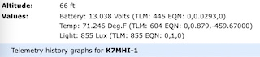

Example of a simple and fun addition to the device. To get some background on what we are trying to accomplish here are some valuable [basics](https://learn.adafruit.com/photocells/using-a-photocell?view=all) on the photo sensor and its place as a sensor in analog logic. We can apply this knowledge to any sensor.

I am using a CdS PCB from a "learn Arduino [kit](https://www.popsci.com/best-arduino-starter-kits/)" which is a cheap way to buy a lot of sensors hook up wire and such you can short it out and replace the DIP as well! This  CdS comes with a 10K resistor surface mount so only hook up wire is needed (no resistor)

you can quickly test out sensor ideas with Arduino and IDE 2.0 is very nice for this.
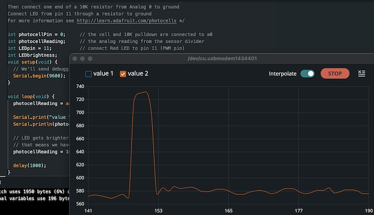

Testing analog CdS sensor with an Arduino using the given example from adafruit, if your graph is upside down, wont be good for aprs.fi as its inverted! As the light level increases, the analog voltage goes up even though the resistance goes down: Vo = Vcc ( R / (R + Photocell) )

That is, the voltage is proportional to the inverse of the photocell resistance which is, in turn, inversely proportional to light levels. We can flip the vcc and negative lines into the pre-fab CdS board, and invert the value to the graph. so Volts @ 0 = Lux ~ 0, each sensor will be different and using an Arduino IDE for testing this in the IDE is much faster vs using the Byonics hardware to figure out your sensor.

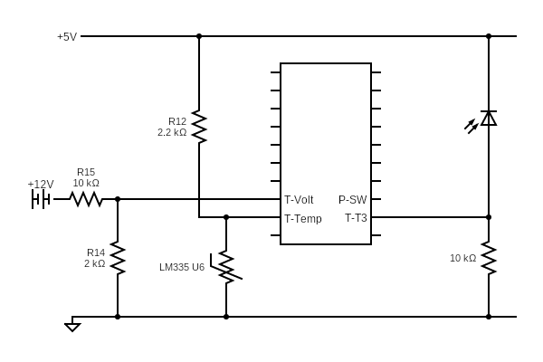

Here is the MT-RTG with the basics of the sensors VOLT TEMP and the example of a CDS, the photo sensor on the right along with a pull down resistor.

Enter the following into APRS network via [findu.com](http://www.findu.com/cgi-bin/entermsg.cgi)
```
Example using F Temp

PARM.Battery,Temp,Light
UNIT.Volts,Deg.F,Lux
EQNS.0,0.0293,0,0,0.879,-459.67,0,1,0
```

# Advanced Software: The Telemetry Definition Text
Recommended to skip this and use APRS messages to change so you don't need to program for each sensor with a USB-TT cable.

allows telemetry definitions to be sent regularly to describe and adjust the telemetry reports
- can we send other data/msg...??

Using this menu/software setting is hard set and replaces the data on aprs.fi 
- its preferred to keep it in the cloud typically the following is better for no internet access

```
CdS Sensor Example
:MYCALL   :PARM.Battery,Temp,Light
:MYCALL   :UNIT.Volts,Deg.F,Lux
:MYCALL   :EQNS.0,0.0293,0,0,0.879,-459.67,0,1,0
:MYCALL   :BITS.00000000,TinyTrak

```
 - MYCALL is the callsign of the tracker, padded with spaces to length 9. 
 - BITS line describes the digital telemetry (not used **but can we feed into PIC PIN-11**), followed by the project name for the telemetry or operation or kit


 ## Advanced-Volts monitor liPo cell
 ```
Cell Volts, Sensor Example using 12v voltage divider value.

:MYCALL   :PARM.Battery,Temp,Cell
:MYCALL   :UNIT.Volts,Deg.F,Volts
:MYCALL   :EQNS.0,0.0293,0,0,0.879,-459.67,0,0.0293,0
:MYCALL   :BITS.00000000,TinyTrak

```

# Reference material
- View T Packets https://aprs.fi/telemetry/a/N0CALL
- PIC 16F1827 [PIC41391D](doc/41391D.pdf)
- Wx serial [data](https://www.peetbros.com/shop/custom.aspx?recid=29)
  - todo: find serial specs for the WX200 / WM918
- More on EQNS on page 70 Telemetry starts a little back on 68 of the [APRS white-papers](http://www.aprs.org/doc/APRS101.PDF)
- PCSAT2 TELEMETRY DEFINITIONS AND [EQUATIONS](http://www.aprs.org/pec/PC2eqns.txt)
- APRS Telemetry [note](http://he.fi/doc/aprs-base91-comment-telemetry.txt) for Base91 and aprs.fi telemetry
- [aprs.fi](https://aprs.fi/doc/guide/aprsfi-telemetry.html) telemetry doc
- [reference](https://github.com/PhirePhly/aprs_notes/blob/master/telemetry_format.md) on telemetry format
- advanced [calculator](https://www.symbolab.com/solver/equation-calculator)
- http://www.aprs.org/labsats/labs08/EA467-Telemetry08c.pdf

Bash telemetry blog posts
- https://s55ma.radioamater.si/2017/07/27/send-aprs-objects-or-telemetry-via-bash/
- https://s55ma.radioamater.si/2017/07/27/send-aprs-datatelemetry-via-xastir-command-line/

Also, the big brother [MicroTrak-MTT4B-mods](https://github.com/SpudGunMan/MicroTrak-MTT4B-mods)

# Findu quick-links for scripting into automation
 - POST into `http://www.findu.com/cgi-bin/sendmsg.cgi?fromcall=N0CALL&tocall=N0CALL&msg=EQNS.0%2C0.0293%2C0%2C0%2C0.879%2C-459.67`
 - pre filled form `www.findu.com/cgi-bin/entermsg.cgi?fromcall=N0CALL-9&tocall=N0CALL`
 - sniff the db `http://www.findu.com/cgi-bin/msg.cgi?call=*`

# Recognition
Thanks to Rob KB8RCO and Allen AF6OF